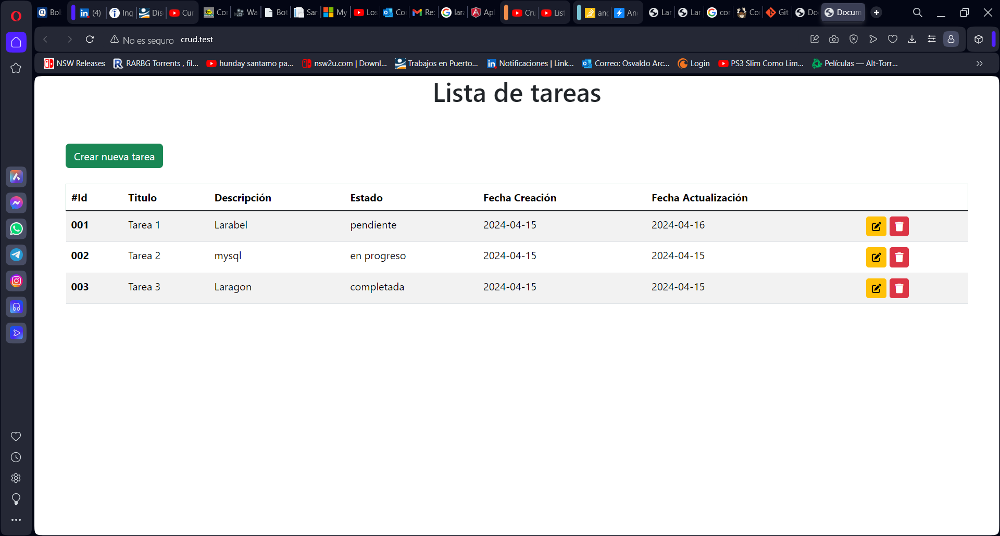
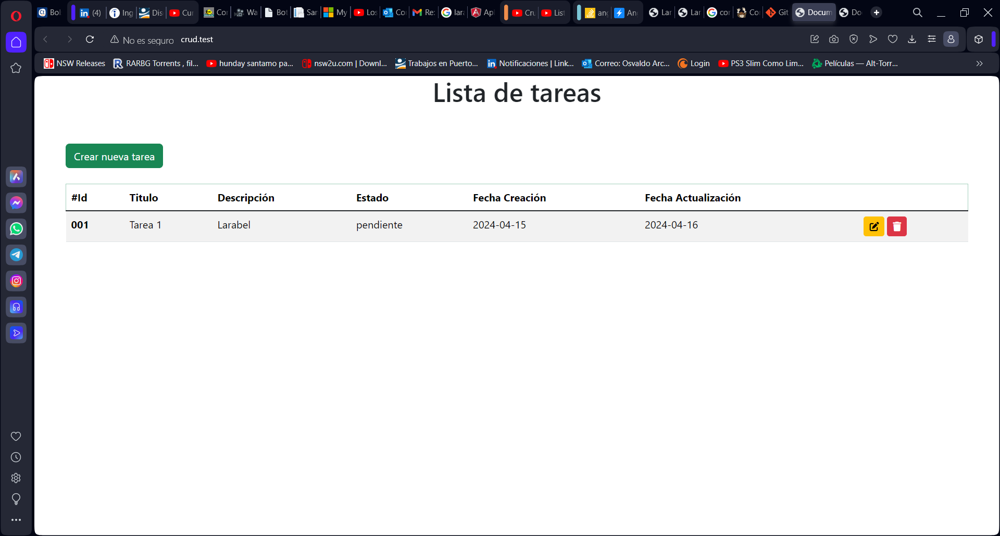
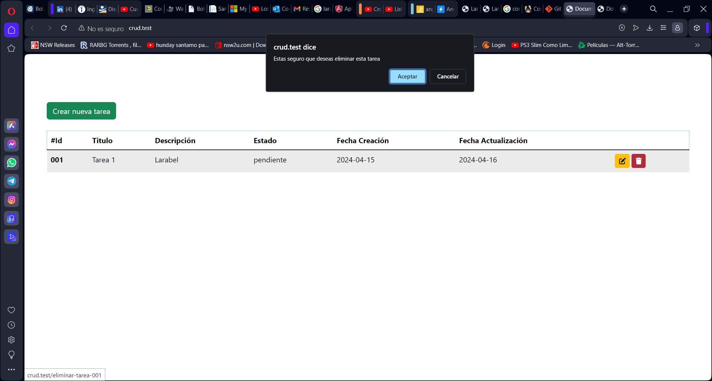
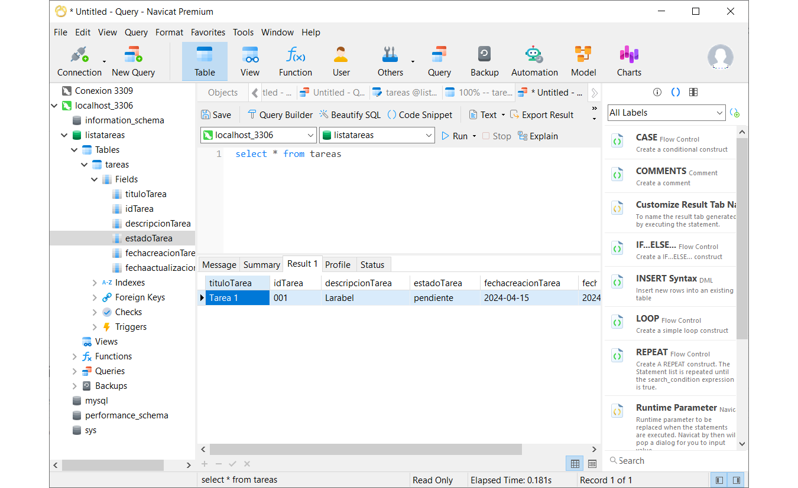

INTRUCCIONES DE INSTALACIÓN

Instalar los siguientes programas:
VScode
mysql
composer
git
laravel
angular
node.js
Navicat (motor de BBDD)
Modificar archivo .env para conexion (es para mi conexion de servidor local), crear con las siguientes caracteristicas:
DB_CONNECTION=mysql
DB_HOST=127.0.0.1
DB_PORT=3306
DB_DATABASE=listatareas
DB_USERNAME=root
DB_PASSWORD=123123

